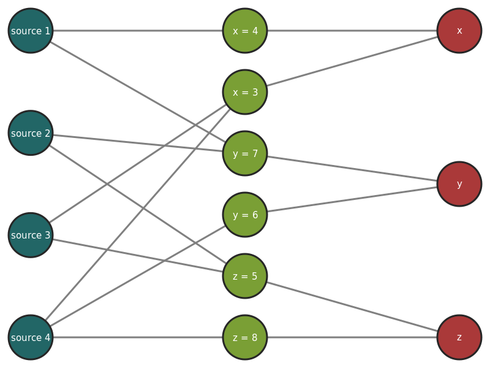
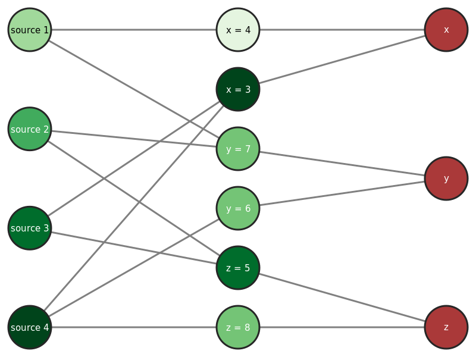

.. _input-page:

Input Data
==========

In this library, objects are referred to as *variables*, and *claims* are
statements asserting that a given variable takes a given value. Input data is
represented by a :any:`Dataset` object, which is constructed by passing an
iterable of tuples of the form ``(source_label, var_label, value)``
for each claim that is made.

For example, consider the following situation:

- Source 1 claims X = 4, Y = 7
- Source 2 claims Y = 7, Z = 8
- Source 3 claims X = 3, Z = 5
- Source 4 claims X = 3, Y = 6, Z = 8

This dataset can be constructed as follows. ::

    from truthdiscovery import Dataset
    tuples = [
        ("source 1", "x", 4),
        ("source 1", "y", 7),
        ("source 2", "y", 7),
        ("source 2", "z", 5),
        ("source 3", "x", 3),
        ("source 3", "z", 5),
        ("source 4", "x", 3),
        ("source 4", "y", 6),
        ("source 4", "z", 8)
    ]
    mydata = Dataset(tuples)

Note that source labels, variable labels, and variable values can be any types,
not just strings/numbers as in the above example (the only caveat is that they
must be `hashable <https://docs.python.org/3/glossary.html#term-hashable>`_
types so they can be used as dictionary keys).

..

Data with numeric values only
-----------------------------

In the above example all values are numeric, so the dataset can alternatively
be created as a :any:`MatrixDataset`. This is done by giving a matrix where
rows correspond to sources, columns correspond to variables, and an entry at
position ``(i, j)`` is the value that source ``i`` claims for variable ``j``
(the matrix may contain empty cells in cases where a source does not make a
claim about a variable).

In matrix form, the example is:

.. math::
   \begin{bmatrix}
   4 & 7 & - \\
   - & 7 & 8 \\
   3 & - & 5 \\
   3 & 6 & 8 \\
   \end{bmatrix}

where the columns correspond to X, Y and Z respectively. Note that the sources
and variable are not explicitly assigned labels (e.g. ``source 1``, ``x``) as
they are when using the :any:`Dataset` constructor.

Matrices are representing using numpy's *masked array* type; the above example
can be constructed as follows. ::

   import numpy.ma as ma
   from truthdiscovery import MatrixDataset

   mydata = MatrixDataset(ma.masked_values([
       [4, 7, 0],
       [0, 7, 8],
       [3, 0, 5],
       [3, 6, 8]
   ], 0))

:any:`MatrixDataset` objects can also be loaded from a file using the
:meth:`~truthdiscovery.input.matrix_dataset.MatrixDataset.from_csv` method. The
above dataset in CSV format would be::

    4,7,
    ,7,8
    3,,5
    3,6,8

Implications between claims
---------------------------

As well as considering sources and claimed variable values, some algorithms
consider *implications between claims*. The idea is that if a given claim is
considered believable, claims that it implies should be considered believable
too. Currently *TruthFinder* [1]_ is the only algorithm implemented here that
considers implications.

To be precise, the implication between claims ``var = x`` and ``var = y`` is a
value in [-1, 1] that describes how the confidence that ``var = x`` influences
the confidence of ``var = y``.  A positive value indicates that if ``var = x``
is true, then ``var = y`` is likely to be true. A negative value means that if
``var = x`` is true, then ``var = y`` is likely to be false [1]_.

The implication values are domain-specific and need to be given on a
per-dataset basis. They may be based on *similarity*, where the implication is
close to 1 when ``x`` and ``y`` are similar and close to -1 when they are
dissimilar. In general claim implications need not be symmetric (i.e. ``var=x
-> var=y`` can be different from ``var=y -> var=x``).

In this library implication values can be optionally given by passing a
function for the ``implication_function`` argument to the constructor for
:any:`Dataset` (or its sub-classes). This function should accept arguments
``(var, val1, val2)`` and return a value in [-1, 1], or None to indicate no
implication.  ::

    import math
    from truthdiscovery import Dataset
    tuples = [
        ("source 1", "x", 4),
        ("source 1", "y", 7),
        ("source 2", "y", 7),
        ("source 2", "z", 5),
        ("source 3", "x", 3),
        ("source 3", "z", 5),
        ("source 4", "x", 3),
        ("source 4", "y", 6),
        ("source 4", "z", 8)
    ]
    def imp(var, val1, val2):
        # Implication is close to 1 when val1, val2 are close, and goes to -1
        # when they are far apart.
        #
        # Note that this example does not consider the value of `var`. In
        # principle the calculation for implication can differ between
        # variables.
        return 2 * math.exp(-(val1 - val2)**2) - 1

    mydata = Dataset(tuples, implication_function=imp)

Datasets with known true values
-------------------------------

An easy way to evaluate the performance of a truth-discovery algorithm is to
run it on a dataset for which the true values of some of the variables is
already known. A measure of the *accuracy* of the algorithm can then be
computed by considering how many variables the algorithm predicted the correct
value (i.e. the most believed value for a variable was the correct one).

To this end, the :any:`SupervisedData` class stores a :any:`Dataset` along with
known true variable values as a dictionary in the form
``{var_label: true_value, ...}``. For example: ::

    from truthdiscovery import SupervisedData

    supervised = SupervisedData(mydata, {"x": 4, "y": 5})

    # run an algorithm and compute accuracy...
    results = myalg.run(supervised.data)
    accuracy = supervised.get_accuracy(results)

See :meth:`~truthdiscovery.input.supervised_data.SupervisedData.get_accuracy`
for a description of how the accuracy calculation is performed.

Supervised data can also be loaded from a matrix in a CSV file. The format is
the same as for unsupervised matrix data (see above), but the first row
contains the true values.

Synthetic data
--------------

It is also possible to generate *synthetic datasets*, where sources, variables
and claims are generated randomly according to some given parameters. This
provides an easy way to test algorithms on datasets of different sizes, with
different distributions for trust among sources, and to test accuracy without
collecting real-world data. For example: ::

    import numpy as np
    from truthdiscovery import SyntheticData

    synth = SyntheticData(
        trust=np.random.uniform(size=(4,)),
        num_variables=10,
        claim_probability=0.5,
        domain_size=4
    )

See the :any:`SyntheticData` constructor for an explanation of the available
parameters. The above example creates a dataset with 4 sources (each with trust
value drawn from a uniform distribution on [0, 1]) and 10 variables with values
in ``{0, 1, 2, 3}``, where a source claims a value for roughly half of the
variables.

:any:`SyntheticData` is a sub-class of :any:`SupervisedData` (the 'true' value
of each variable is generated randomly before source claims are generated), so
accuracy calculations can be performed with synthetic data as shown in the
previous section.

Synthetic data can be exported to CSV (the same format that can be loaded by
:meth:`~truthdiscovery.input.supervised_data.SupervisedData.from_csv` for
supervised data) with the
:meth:`~truthdiscovery.input.synthetic_data.SyntheticData.to_csv` method.

Custom dataset formats
----------------------

In a real-world application of truth-discovery, data will most likely be loaded
from a file in a bespoke format. The most suitable format for storing datasets
in files may be domain-specific, or the format may be already fixed if applying
truth-discovery to existing datasets.

For these reasons, this library does not attempt to provide a standard format
for loading files from disk (except for the CSV format for matrix datasets
described above, which is of limited use in real-world data scenarios where
variable values are not always integers).

Instead, there are two helper classes :any:`FileDataset` and
:any:`FileSupervisedData` that allow the user to specify only the
format-specific details, and abstract away other details.

For example, suppose ``mydata.txt`` contains::

    source 1: x=4, y=7
    source 2: y=7, x=8
    source 3: x=3, z=5
    source 4: x=3, y=6, z=8

To load this file we can create a sub-class of :any:`FileDataset` and implement
the :meth:`~truthdiscovery.input.file_helpers.FileDataset.get_tuples` method::

    class DemoFileDataset(FileDataset):
        def get_tuples(self, fileobj):
            """
            Read each line of the file, and extract source label and claims (note
            that no error checking is performed, since this is just a demo)
            """
            for line in fileobj:
                line = line.strip()
                source, claims = line.split(": ")
                for claim in claims.split(", "):
                    var, value = claim.split("=")
                    yield (source, var, value)

:meth:`~truthdiscovery.input.file_helpers.FileDataset.get_tuples` simply yields
data tuples of the form required for the :any:`Dataset` constructor. To load
the file we simply pass the file path to the constructor::

    >>> mydata = DemoFileDataset("mydata.txt")
    >>> mydata.num_sources
    4
    >>> mydata.num_variables
    3
    >>> from truthdiscovery import MajorityVoting
    >>> results = MajorityVoting().run(mydata)
    >>> results.trust
    {'source 1': 1, 'source 2': 1, 'source 3': 1, 'source 4': 1}
    >>> results.belief
    {'x': {'4': 1.0, '8': 1.0, '3': 2.0}, 'y': {'7': 2.0, '6': 1.0}, 'z': {'5':
    1.0, '8': 1.0}}
    >>>

The results of majority voting (where the belief score for a claim is simply
the number of sources making that claim, and all sources receive trust score 1)
shows that the data was loaded as expected.

Loading supervised data from a file is similar: we may create a sub-class of
:any:`FileSupervisedData` and implement
:meth:`~truthdiscovery.input.file_helpers.FileSupervisedData.get_pairs`, which
yields pairs ``(var, true_value)``. An object is then constructed with::

    mysup = DemoSupervisedFileData(dataset, "true_values.txt")

For another example, see ``stock_dataset.py`` in the ``examples`` directory in
the repository.

Visual graph representation
---------------------------

A truth-discovery dataset can also be represented as directed graph, where the
nodes are the sources, claims and objects, and there is an edge from each
source to each claim it makes, and an edge between each claim and the variable
it relates to.

Such graphs can be created as a PNG image with the :any:`GraphRenderer`
class. ::

    from truthdiscovery.input import Dataset
    from truthdiscovery.graphs import GraphRenderer
    tuples = [
        ("source 1", "x", 4),
        ("source 1", "y", 7),
        ("source 2", "y", 7),
        ("source 2", "z", 5),
        ("source 3", "x", 3),
        ("source 3", "z", 5),
        ("source 4", "x", 3),
        ("source 4", "y", 6),
        ("source 4", "z", 8)
    ]
    mydata = Dataset(tuples)
    renderer = GraphRenderer(mydata)
    with open("/tmp/my-dataset-as-a-graph.png", "wb") as imgfile:
        renderer.draw(imgfile)

Note that the output file must be opened in binary mode. See the
:any:`GraphRenderer` documentation for the available options (such as image
size, node size, line widths etc...).

To visualise results of an algorithm, it is possible to colour nodes according
to their scores in the results by using the :any:`ResultsGradientColourScheme`
colour scheme: ::

    from truthdiscovery.algorithm import Sums
    from truthdiscovery.graphs import GraphRenderer, ResultsGradientColourScheme

    results = Sums().run(mydata)
    colour_scheme = ResultsGradientColourScheme(results)
    renderer = GraphRenderer(mydata, colours=colour_scheme)

Lighter and darker colours represent low and high trust/belief scores
Respectively. Note that there are 9 fixed colours in this scale -- it is *not*
a continuous gradient. This means that nodes with the same colour do not
necessarily have identical trust/belief scores.

References
----------

.. [1] X. Yin and J. Han and P. S. Yu, `Truth Discovery with Multiple Conflicting
   Information Providers on the Web
   <http://ieeexplore.ieee.org/document/4415269/>`_.
