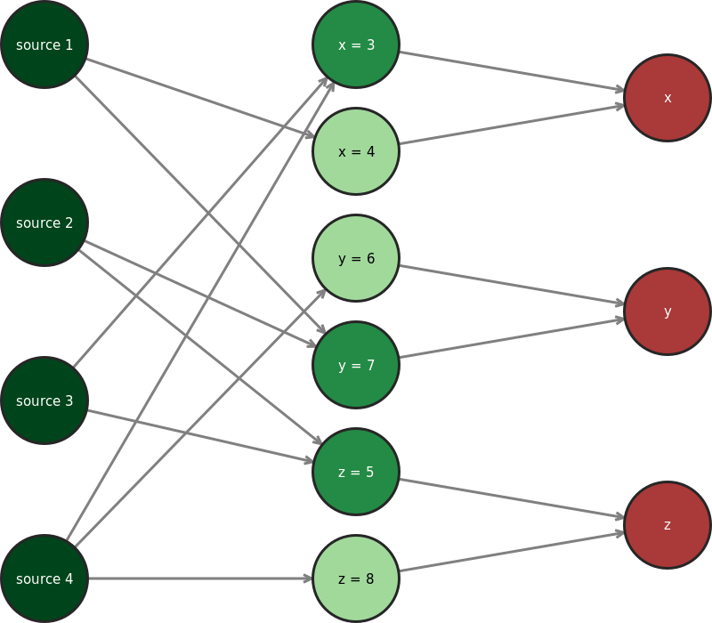

.. _visual-page:

Visual dataset and results representation
=========================================

Datasets
--------

A truth discovery dataset can be represented visually as directed graph, where
the nodes are the sources, claims and objects, and there is an edge from each
source to each claim it makes, and an edge between each claim and the variable
it relates to.

Such graphs can be created as a PNG image with the :any:`GraphRenderer`
class. ::

    from truthdiscovery import Dataset, GraphRenderer
    tuples = [
        ("source 1", "x", 4),
        ("source 1", "y", 7),
        ("source 2", "y", 7),
        ("source 2", "z", 5),
        ("source 3", "x", 3),
        ("source 3", "z", 5),
        ("source 4", "x", 3),
        ("source 4", "y", 6),
        ("source 4", "z", 8)
    ]
    mydata = Dataset(tuples)
    renderer = GraphRenderer()
    with open("/tmp/my-dataset-as-a-graph.png", "wb") as imgfile:
        renderer.render(mydata, imgfile)

.. figure:: images/example_graph_dataset.png

Note that the output file must be opened in binary mode. See the
:any:`GraphRenderer` documentation for the available options (such as image
size, node size, line widths etc...).

Results
-------

The results of a truth discovery algorithm can be visualised in the graph
representation by colouring the sources/claims according to their trust and
belief scores. This is done with the :any:`ResultsGradientColourScheme` colour
scheme: ::

    from truthdiscovery import Sums, GraphRenderer, ResultsGradientColourScheme
    # create `mydata` as above...
    results = Sums().run(mydata)
    colour_scheme = ResultsGradientColourScheme(results)
    renderer = GraphRenderer(colours=colour_scheme)
    with open("/tmp/my-dataset-with-results.png", "wb") as imgfile:
        renderer.render(mydata, imgfile)

.. figure:: images/example_graph_dataset_results_based.png

Lighter and darker colours represent low and high trust/belief scores
Respectively. Note that there are 9 fixed colours in this scale -- it is *not*
a continuous gradient. This means that nodes with the same colour do not
necessarily have identical trust/belief scores.

Animations
----------

For iterative algorithms, one may wish to visualise not just the final results,
but the partial results at each iteration as the algorithm progresses. The
:any:`GifAnimator` class implements creating animated GIF files for this
purpose: ::

    from truthdiscovery import (
        ConvergenceIterator, Dataset, DistanceMeasures, GifAnimator, Investment
    )

    tuples = [
        ("source 1", "x", 4), ("source 1", "y", 7), ("source 2", "y", 7),
        ("source 2", "z", 5), ("source 3", "x", 3), ("source 3", "z", 5),
        ("source 4", "x", 3), ("source 4", "y", 6), ("source 4", "z", 8)
    ]
    mydata = Dataset(tuples)

    alg = Investment(iterator=ConvergenceIterator(DistanceMeasures.L2, 0.01))
    animator = GifAnimator(frame_duration=0.2)  # 0.2 seconds per iteration

    with open("/tmp/animation.gif", "wb") as imgfile:
        animator.animate(imgfile, alg, mydata)

